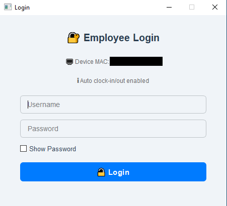
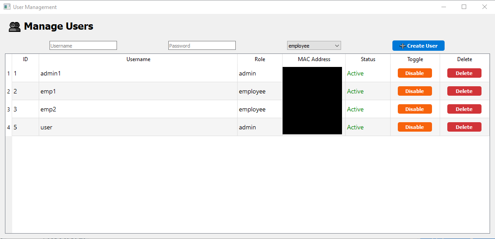
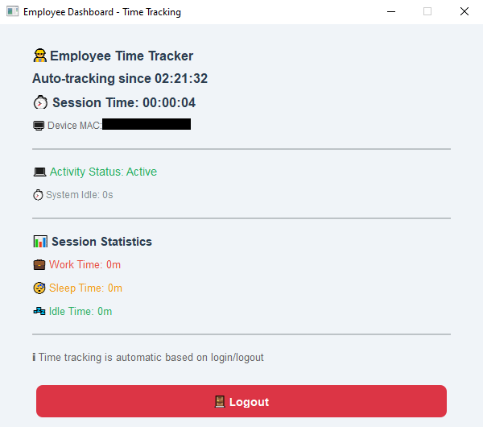
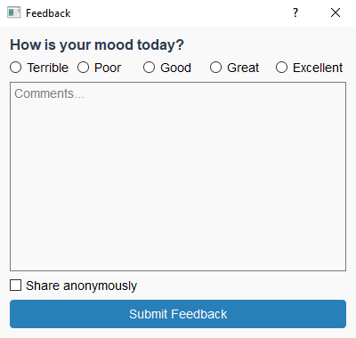

# 🖥️ System Sleep Tracker

A powerful Windows-based time tracking application built with Python and SQL Server. This tool helps organizations monitor employee productivity by tracking system usage patterns — including clock in/out times, system sleep/lock sessions, and idle time — all with real-time logging and a clean GUI interface.

---

## 🚀 Key Features

- ⏰ **Clock In / Clock Out Logging**  
  Employees can easily log their start and end of work with timestamps recorded in a central SQL Server database.

- 💤 **System Sleep & Lock Tracking**  
  Automatically detects when the system enters sleep or lock mode and logs the duration of inactivity.

- 🪑 **Idle Time Monitoring**  
  Tracks user inactivity (no keyboard/mouse input) and notifies admins if idle time crosses thresholds.

- 🧑‍💻 **Role-based Dashboards**  
  - **Admin Dashboard:** View real-time reports, track multiple users, and analyze productivity metrics.  
  - **Employee Dashboard:** Users can track their own logs and provide session feedback.

- 💡 **Feedback System**  
  Integrated feedback dialog for reporting technical issues or daily summaries.

- 🔐 **Secure Database Configuration**  
  Config-driven connection to SQL Server for secure and centralized data management.

- 🛠️ **Installer Included**  
  `.exe` and installer created using `PyInstaller` and `Inno Setup` for smooth deployment on Windows systems.

---

## 📂 Folder Structure

```bash
System Sleep Tracker EXE/
│
├── assets/                          # App icons and branding assets
│
├── build/                           # Auto-generated build files from PyInstaller
│   └── System Sleep Tracker/        # Temporary files for EXE generation
│
├── config/                          # Configuration files
│   └── db_config.json               # SQL Server connection settings
│
├── database/                        # Database logic and query handlers
│   ├── db_connection.py             # Establishes DB connection
│   └── queries.py                   # Query definitions and DB operations
│
├── dist/                            # Final executable output
│   └── System Sleep Tracker.exe     # Standalone executable for the application
│
├── gui/                             # GUI components (built using PyQt5)
│   ├── admin_dashboard.py           # Admin view interface
│   ├── employee_dashboard.py        # Employee view interface
│   ├── feedback_dialog.py           # Dialog for feedback submission
│   ├── login_window.py              # Login interface
│   └── manage_users.py              # Admin tool to manage users
│
├── Output/                          # Installer output
│   └── SystemSleepTrackerInstaller.exe # Setup installer created via Inno Setup
│
├── utils/                           # Utility scripts for system monitoring
│   ├── activity_monitor.py          # Tracks user activity and sessions
│   ├── idle_monitor.py              # Detects user idle time
│   ├── mac_address.py               # Fetches system MAC address
│   ├── session_timeout.py           # Handles session timeout events
│   ├── session_tracker.py           # Tracks login/logout and session duration
│   └── theme_manager.py             # Handles UI theming
│
├── main.py                          # Main entry point
├── README.md                        # Project documentation
├── requirements.txt                 # Python dependencies
├── SystemSleepTracker.spec          # PyInstaller spec file
├── SystemSleepTrackerInstaller.iss  # Inno Setup script for the installer
└── SQL.txt                          # Sample SQL schema or queries
```

---

## 🔧 Installation

### 🐍 Prerequisites (for development)

- Python 3.10+
- SQL Server (local or remote)
- PyQt5
- `pywin32`, `psutil`, and other dependencies listed in `requirements.txt`

### 🪄 Setup

1. Clone the repository:
   ```bash
   git clone https://github.com/your-username/system-sleep-tracker.git
   cd system-sleep-tracker
   ```

2. Install dependencies:
   ```bash
   pip install -r requirements.txt
   ```

3. Configure your DB:  
   Update the `config/db_config.json` file with your SQL Server credentials.

4. Run the application:
   ```bash
   python main.py
   ```

### 📦 For End Users

Use the provided `SystemSleepTrackerInstaller.exe` in the `Output/` folder for a hassle-free Windows installation.

---

## 📊 Use Cases

- 🔍 HR and Admin teams looking to analyze work patterns
- 🧠 Productivity research and behavior analysis
- 🛡️ System security and activity audits
- 💼 Remote or hybrid workforce time tracking

---

## 📸 Screenshots

### 🔐 Login Window


### 👨‍💼 Admin Dashboard


### 👥 Manage Users


### 👨‍💻 Employee Dashboard


### ✉ Feedback Form


> Screenshots are stored in: `assets/`

---

## 🤝 Contribution

Contributions are welcome! Please fork the repository and submit a pull request with enhancements or fixes.

---

## ✨ Author

**Lokesh Deep**

*Open to collaboration and feedback*
